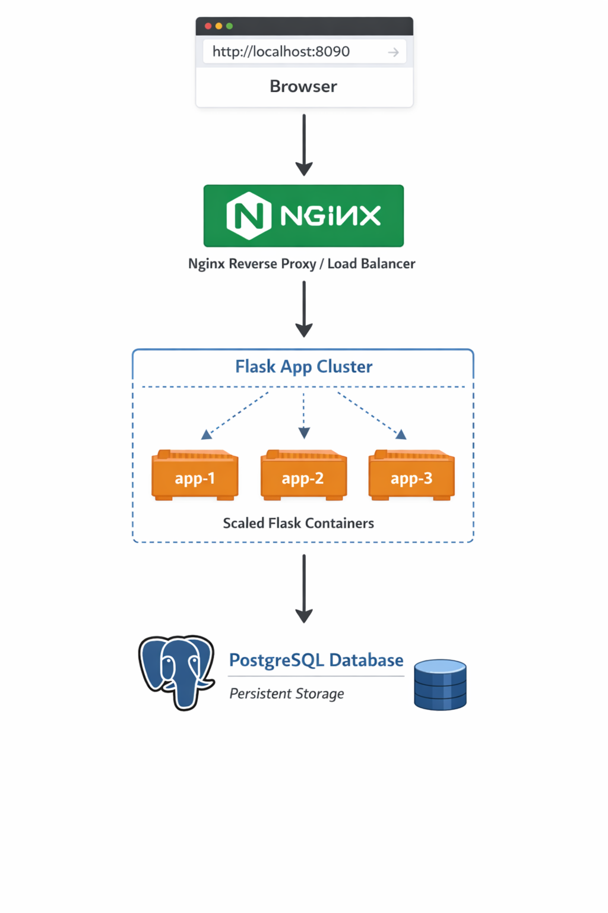

# Docker Compose Microservices Demo

This project demonstrates a production-style container architecture using **Docker Compose**.

The application consists of multiple services working together:

- Flask application
- PostgreSQL database
- Nginx reverse proxy (load balancer)

This setup simulates how modern containerized applications are structured.

---

## Architecture

This project stimulated a production-style container architecture using Docker Compose.


```
Browser
   ↓
Nginx (Reverse Proxy)
   ↓
Flask App Containers (Scaled)
   ↓
PostgreSQL Database
```
## How It Works

1. The browser sends a request to Nginx.
2. Nginx acts as a reverse proxy and distributes traffic across multiple Flask containers.
3. Each Flask container processes the request and connects to the PostgreSQL database.
4. PostgreSQL stores data using a persistent volume so data survives container restarts.

---

## Features

- Multi-container application using Docker Compose
- Reverse proxy with Nginx
- Horizontal scaling of application containers
- Container-to-container communication via Docker network
- Persistent database storage using volumes

---

## Project Structure

```
docker-nginx-flask-postgres-demo
│
├── app
│   ├── app.py
│   ├── requirements.txt
│   └── Dockerfile
│
├── nginx
│   └── nginx.conf
│
├── docker-compose.yml
└── README.md
```

---

## Running the Project

Clone the repository:

```bash
git clone https://github.com/yourusername/docker-nginx-flask-postgres-demo.git
cd docker-nginx-flask-postgres-demo
```

Start the containers:

```bash
docker compose up --build --scale app=3
```

Access the application:

```
http://localhost:8090
```

---

## How It Works

1. Nginx acts as a reverse proxy.
2. Incoming requests are distributed across multiple Flask containers.
3. Flask containers communicate with PostgreSQL using Docker service networking.
4. Database data is persisted using Docker volumes.

---

## Example Output

Refreshing the application shows responses from different containers:

```
Database connection successful from container a975d697a73f
Database connection successful from container 1b20c8f0d3aa
Database connection successful from container 5a7e0c9b93fa
```

This demonstrates **load balancing across containers**.

---

## Future Improvements

- Add health checks
- Implement CI/CD pipeline
- Add monitoring with Prometheus and Grafana
- Deploy the application on Kubernetes

---

## Learning Goals

This project helped me understand:

- Docker container networking
- Reverse proxy architecture
- Horizontal scaling
- Persistent storage in containers
- Multi-service application design

---
